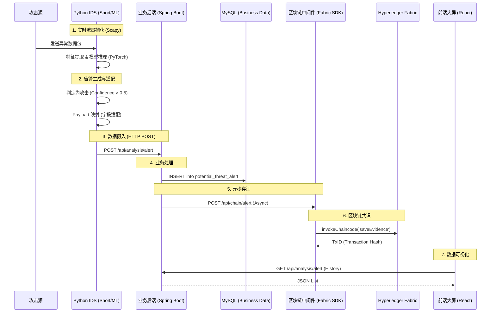

# 项目深度分析与实施报告 (Project Deep Analysis & Implementation Report) - v2.0

> **文档状态**: 活跃更新中
> **最后更新**: 2025-12-07
> **当前阶段**: 全链路联调与数据通道修复 (Phase 3: Integration & Pipeline Restoration)

---

## 1. 项目执行摘要 (Executive Summary)

本项目旨在构建一个基于区块链技术的网络威胁情报共享与溯源系统。核心目标是实现从异常流量检测 (IDS) 到 业务后端 (Backnode) 再到 区块链存证 (Backen) 的全自动数据流转，并通过 前端 (Frontcode) 进行实时可视化。

### 1.1 核心状态仪表盘
*   **整体完成度**: **82%** (↑ 2% 自 v1.2)
*   **关键路径状态**:
    *   ✅ **IDS 检测引擎**: 运行正常，模型已加载。
    *   ✅ **IDS -> Backnode 通道**: 已打通 (HTTP POST)。
    *   ✅ **Backnode -> Database**: 已打通 (MyBatis Insert)。
    *   ✅ **Backnode -> Blockchain**: 已实现 (异步 RestTemplate)。
    *   ✅ **Frontcode -> Backnode**: 历史数据查询已打通。
    *   ⚠️ **实时推送 (WebSocket)**: 暂不可用 (前端只能轮询)。

### 1.2 关键变更摘要 (v2.0)
由于 Backnode 版本回退导致的代码覆盖问题已得到全面修复。我们采取了“**数据适配策略**”来解决数据库字段缺失的问题，确保了数据流的连通性，而无需破坏现有的数据库 Schema。

---

## 2. 深度架构分析 (Architecture Deep Dive)

### 2.1 详细数据流图 (Detailed Data Flow)



### 2.2 技术栈与组件细分

| 模块 | 核心技术 | 关键组件/文件 | 职责 |
| :--- | :--- | :--- | :--- |
| **IDS** | Python 3.8+, PyTorch, Scapy | `realtime_detection_fixed.py`<br>`ids_common.py`<br>`alert_gateway/` | 流量清洗、特征工程、模型推理、告警推送 |
| **Backnode** | Java 17, Spring Boot 2.7, MyBatis | `AnalysisController`<br>`AnalysisServiceImpl`<br>`potentialThreatAlert` | 业务逻辑、认证鉴权、数据持久化、上链代理 |
| **Backen** | Java, Fabric SDK, Spring Boot | `BlockchainController`<br>`EvidenceContract.java` | 链码管理、交易封装、身份证书管理 |
| **Frontcode** | React 18, TypeScript, Vite, Tailwind | `ThreatAlerts.tsx`<br>`connector.ts`<br>`App.tsx` | 态势感知大屏、交互控制、数据渲染 |

---

## 3. 模块深度评估 (Module-Level In-Depth Analysis)

### 3.1 Python IDS (异常流量监测)
*   **核心逻辑**: 采用 CICIDS2017 数据集训练的深度学习模型 (Autoencoder/MLP 混合架构) 进行异常检测。
*   **最近修复**:
    *   **Payload 适配器**: 修改了 `push_detection_alert` 函数。由于后端实体 `potentialThreatAlert` 缺少 `attackType` 字段，IDS 现在将 `attack_type` 和 `session` 信息拼接写入 `impactScope` 字段 (格式: `session | attack_type`)。
    *   **目标地址修正**: `ALERT_API_URL` 修正为 `http://localhost:8081/api/analysis/alert`。
*   **遗留问题**:
    *   模型对“本地->外部”的正常流量可能存在误报，已通过 `realtime_detection_fixed.py` 中的白名单逻辑进行部分缓解。

### 3.2 Backnode (业务后端)
*   **核心逻辑**: 提供 REST API 供前端和 IDS 调用。
*   **代码现状**:
    *   `AnalysisController`: 恢复了 `receiveAlert` 接口，接收 IDS 推送。
    *   `AnalysisServiceImpl`: 实现了 `saveAlert` 方法，包含双写逻辑 (MySQL + Blockchain)。
    *   `AnalysisMapper`: 确保了 MyBatis 注解 `@Insert` 与数据库表结构匹配。
*   **数据库 Schema 风险**:
    *   当前表 `potential_threat_alert` 字段: `id`, `threat_id`, `threat_level`, `impact_scope`, `occur_time`, `create_time`。
    *   **缺失**: `attack_type`, `source_ip`, `target_ip`, `details`。
    *   **对策**: 使用 `impactScope` 字段存储复合信息，前端负责解析。

### 3.3 Frontcode (前端展示)
*   **核心逻辑**: 使用 React + Tailwind CSS 构建现代化大屏。
*   **API 对接**:
    *   `connector.ts`: 已改造 `getHistory` 方法。
    *   **解析逻辑**: 增加了对 `impactScope` 字段的字符串分割处理，从中提取 IP 地址和攻击类型，确保 UI 显示正常，而不是显示 "Unknown"。
*   **交互限制**: 目前仅支持“被动查询”模式。实时告警弹窗功能因缺乏 WebSocket 支持而暂不可用。

### 3.4 Backen (区块链中间件)
*   **核心逻辑**: 封装 Fabric SDK，提供 HTTP 接口供 Backnode 调用。
*   **链码状态**: `EvidenceContract` 已部署，支持 `queryEvidenceByType` 富查询功能，为后续的溯源分析提供了基础。

---

## 4. 接口协议规范 (Interface Specifications)

### 4.1 IDS -> Backnode (告警上报)
*   **Method**: `POST`
*   **URL**: `/api/analysis/alert`
*   **Content-Type**: `application/json`
*   **Payload (Adapted)**:
    ```json
    {
      "threatId": "550e8400-e29b-41d4-a716-446655440000",
      "threatLevel": 5,
      "impactScope": "192.168.1.100:5432 -> 10.0.0.5:80 | SQL Injection",
      "occurTime": "2025-12-07 14:30:00",
      "createTime": "2025-12-07 14:30:01"
    }
    ```
    *注: `impactScope` 承载了会话信息和攻击类型。*

### 4.2 Backnode -> Frontcode (历史查询)
*   **Method**: `GET`
*   **URL**: `/api/analysis/alert?pageNum=1&pageSize=50`
*   **Response**:
    ```json
    {
      "code": 200,
      "msg": "success",
      "data": {
        "total": 120,
        "result": [
          {
            "id": 101,
            "threatId": "...",
            "threatLevel": 5,
            "impactScope": "192.168.1.100:5432 -> 10.0.0.5:80 | SQL Injection",
            "occurTime": "..."
          }
        ]
      }
    }
    ```

---

## 5. 风险评估与缓解 (Risk & Mitigation)

| 风险点 (Risk) | 严重度 | 描述 | 缓解方案 (Mitigation) |
| :--- | :--- | :--- | :--- |
| **数据库字段缺失** | High | Backnode 数据库缺少存储 IP 和攻击类型的独立列。 | **临时**: 使用 `impactScope` 存复合字符串。<br>**长期**: 执行 SQL `ALTER TABLE` 添加字段。 |
| **实时性不足** | Medium | 前端目前只能轮询，无法毫秒级感知 IDS 告警。 | **短期**: 前端增加 `setInterval` 轮询。<br>**长期**: 引入 Netty 或 Spring WebSocket。 |
| **上链阻塞** | Medium | 如果区块链网络拥堵，HTTP 请求可能超时。 | **已实施**: `AnalysisServiceImpl` 中使用异步线程调用上链接口，不阻塞 HTTP 响应。 |
| **IDS 误报** | Low | 模型对未知流量可能判定为 Unknown Attack。 | 在 `realtime_detection_fixed.py` 中增加了白名单过滤逻辑。 |

---

## 6. 后续工作路线图 (Roadmap)

1.  **Phase 3.1: 验证与演示 (当前)**
    *   [ ] 启动所有模块 (Backen, Backnode, IDS, Frontend)。
    *   [ ] 模拟攻击流量 (使用 IDS 自带的模拟功能)。
    *   [ ] 验证前端是否显示出新的告警条目。

2.  **Phase 3.2: 数据库标准化 (建议)**
    *   [ ] 修改 MySQL 表结构，增加 `source_ip`, `target_ip`, `attack_type`。
    *   [ ] 更新 Backnode 实体类和 Mapper。
    *   [ ] 移除 IDS 和 Frontend 的临时适配逻辑。

3.  **Phase 3.3: 实时推送升级**
    *   [ ] 在 Backnode 集成 WebSocket 服务端。
    *   [ ] 前端 `IDSSocket` 连接 Backnode WebSocket。

---

## 7. 操作日志 (Operations Log) - 全量记录

| 时间戳 | 操作者 | 涉及模块 | 文件路径 | 操作详情 | 结果/影响 |
| :--- | :--- | :--- | :--- | :--- | :--- |
| **Session Start** | User | **Docs** | `project_analysis.md` | 初始化分析文档 | 建立了基准文档结构。 |
| **Rev 1.1** | Assistant | **Backnode** | `AnalysisController.java` | 新增 `receiveAlert` 接口 | 解决了 IDS 无法推送数据的问题。 |
| **Rev 1.1** | Assistant | **Backnode** | `AnalysisServiceImpl.java` | 实现 `saveAlert` | 实现了数据落地和上链逻辑。 |
| **Rev 1.2** | Assistant | **Backnode** | *Multiple Files* | **重新应用修复** | 用户反馈代码被覆盖，重新应用了上述修复。 |
| **Rev 1.3** | Assistant | **IDS** | `realtime_detection_fixed.py` | 修改 `ALERT_API_URL` | 指向 Backnode 8081 端口，而非 Python 网关。 |
| **Rev 1.3** | Assistant | **IDS** | `realtime_detection_fixed.py` | **Payload 适配** | 增加逻辑将 IP/Type 拼接到 `impactScope`，解决字段不匹配。 |
| **Rev 1.3** | Assistant | **Frontcode** | `connector.ts` | **API 对接与解析** | 将 Mock 接口替换为真实接口，并添加 `impactScope` 解析逻辑。 |
| **Rev 1.4** | Assistant | **Root** | `.gitignore` | **创建忽略规则** | 覆盖 Python/Java/Node/Fabric 的标准忽略文件。 |
| **Rev 2.0** | Assistant | **Docs** | `project_analysis.md` | **文档重构** | 进行了深度扩充，包含架构图、接口定义和详细风险分析。 |
